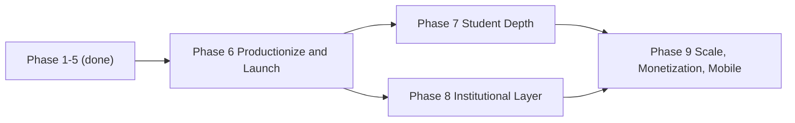

# PlacementOS — Program Roadmap

This is the single-page entry point to the PlacementOS build plan. It indexes every phase, shows how they depend on one another, and links to the detailed phase specifications. Phases 1–5 are implemented (locally); Phases 6–9 are planned.

> **Stack:** FastAPI + SQLAlchemy + Alembic + ARQ (backend) · Next.js 14 + Tailwind + TanStack Query + Zustand (frontend).  
> See [`tech-stack.md`](./tech-stack.md) for architecture details.

---

## How the phases fit together

Phases 1–5 built a feature-complete platform locally. From there the roadmap follows a balanced track: **Phase 6** productionizes and launches the existing student app; **Phase 7** deepens the student experience; **Phase 8** adds the institutional (college/TPO) multi-tenant layer as a parallel track; and **Phase 9** converges both tracks into scale, monetization, and mobile. Student self-serve ships first (Phase 6), the institutional layer follows (Phase 8), matching the "both students and institutions" model.

---

## Phase index

| Phase | Weeks | Focus | Status |
|-------|-------|-------|--------|
| [Phase 1 — Foundation & Infrastructure](./phase-1-foundation.md) | 1–3 | Full-stack skeleton, auth, CI/CD | ✅ Implemented |
| [Phase 2 — Dashboard, LeetCode & GitHub Sync](./phase-2-integrations.md) | 4–6 | LeetCode + GitHub sync, ARQ workers, dashboard | ✅ Implemented |
| [Phase 3 — Learn, Prepare & Opportunities](./phase-3-learn-prepare-opportunities.md) | 7–9 | Question bank, CS/aptitude, opportunity tracker | ✅ Implemented |
| [Phase 4 — Resume, Build & Polish](./phase-4-resume-build-polish.md) | 10–13 | Resume + ATS V1, projects, notifications, polish | ✅ Implemented |
| [Phase 5 — Intelligence, Analytics & Hardening](./phase-5-intelligence-hardening.md) | 14–20 | Interview Twin, ATS V2, analytics, hardening | ✅ Implemented |
| [Phase 6 — Productionization & Launch](./phase-6-productionization.md) | 21–24 | Deploy, real integrations, onboarding, observability | 🔲 Planned |
| [Phase 7 — Student Experience Depth](./phase-7-student-depth.md) | 25–30 | Content/roadmaps, in-app judge, community, mentors, gamification | 🔲 Planned |
| [Phase 8 — Institutional Layer](./phase-8-institutional.md) | 25–32 *(parallel)* | Multi-tenancy, TPO dashboards, drives, reporting | 🔲 Planned |
| [Phase 9 — Scale, Monetization & Mobile](./phase-9-scale-monetization-mobile.md) | 33–40 | Billing, PWA/mobile, advanced AI, scale, data platform | 🔲 Planned |

---

## Dependency notes

- **Phases 1–5** are a linear chain — each built on a stable, tested base before the next shipped.
- **Phase 6** depends on Phase 5 and is the gate to everything after it: nothing else matters until the app is live with real integrations.
- **Phase 7** and **Phase 8** both depend only on Phase 6 and run as **parallel tracks** (overlapping weeks 25–30/32). Phase 7 deepens the student product; Phase 8 adds the institutional layer. They touch mostly different surfaces, so they can proceed concurrently.
- **Phase 8** reuses and extends existing constructs rather than forking: the `UserRole` enum and `require_roles` guard, plus the existing `Opportunity`/`Application` models for drives.
- **Phase 9** depends on **both** Phase 7 and Phase 8 — monetization gates features from both tracks (student Pro tier and institutional per-seat licensing), and scale hardening must account for the combined load.

---

## Status legend

- ✅ **Implemented** — built and passing locally (production launch happens in Phase 6).
- 🔲 **Planned** — specified in the phase doc; not yet built.
